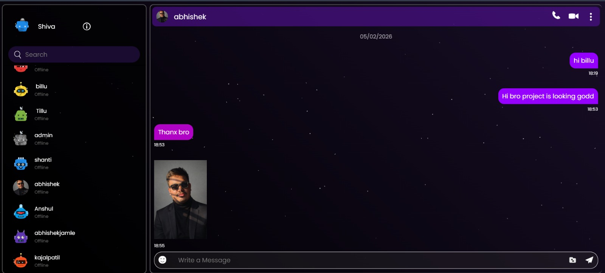
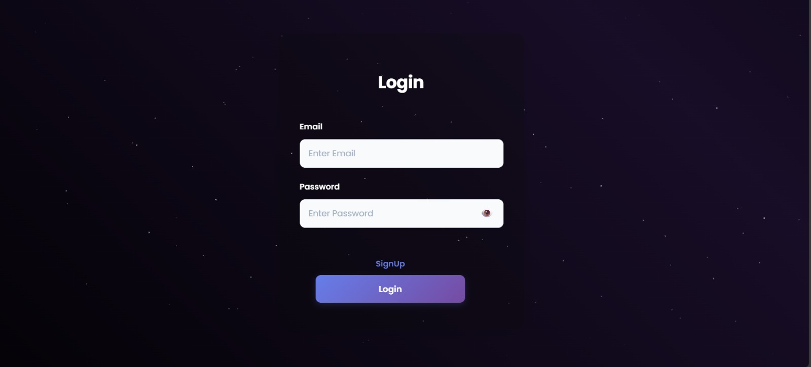
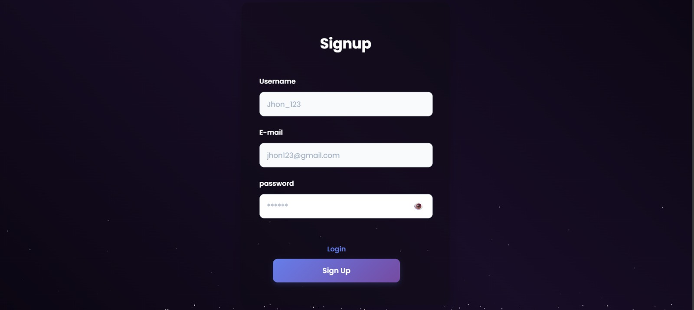
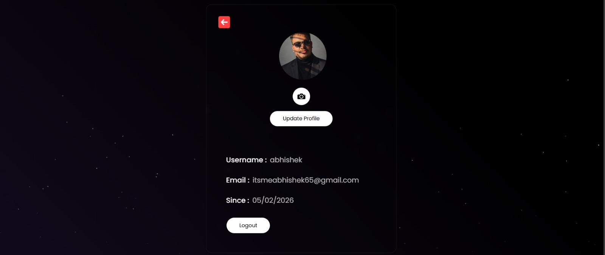

<div align="center">
  

  <p align="center">
    <strong>Connect Instantly. Connect Securely.</strong>
  </p>

  <a href="https://talko-orcin.vercel.app/">
    
  </a>

  <p>
    👆 <strong>Click the button above to start chatting with your friends!</strong> 👆
  </p>

  <p align="center">
    <a href="https://github.com/abhishekpatil009/talko">
      
    </a>
    <a href="https://github.com/abhishekpatil009/talko/stargazers">
      
    </a>
    <a href="https://talko-orcin.vercel.app/">
      
    </a>
  </p>
</div>

---

<details>
  <summary><strong>📝 Table of Contents</strong> (Click to Expand)</summary>

  - [Overview](#-overview)
  - [Live Demo](#-live-demo)
  - [Screenshots](#-screenshots)
  - [Features](#-key-features)
  - [Tech Stack](#-tech-stack)
  - [Installation](#-getting-started)
  - [Author](#-author)
</details>

---

## 🚀 Overview

**Talko** is a robust, real-time messaging platform designed for speed and simplicity. Built on the **MERN Stack**, it leverages **Socket.io** for bidirectional communication, ensuring that messages are delivered instantly without page refreshes. 

Whether you're chatting 1-on-1 or in a group, Talko keeps you connected.

---

## 🌐 Live Demo

Don't just look at the code—experience it!

### [👉 Click here to open Talko](https://talko-orcin.vercel.app/)

> **Try it with a friend:** Open the link in two different browsers (or Incognito mode), create two accounts, and watch the messages fly instantly! ⚡

---

## 📸 Screenshots

<div align="center">
  <h3>✨ The Interface</h3>
  
  <p><em>Sleek, Dark-Themed Messaging Interface</em></p>
</div>

<br/>

<div align="center"> 
  <table>
    <tr>
      <td align="center"><strong>🔐 Secure Login</strong></td>
      <td align="center"><strong>📝 Easy Signup</strong></td>
      <td align="center"><strong>👤 User Profile</strong></td>
    </tr>
    <tr>
      <td></td>
      <td></td>
      <td></td>
    </tr>
  </table>
</div>

---

## ✨ Key Features

| Feature | Description |
| :--- | :--- |
| **⚡ Real-Time** | Instant messaging powered by **Socket.io**. Zero lag. |
| **🔐 Authentication** | JWT-based auth with encrypted passwords (Bcrypt). |
| **🎨 Modern UI** | Built with **Tailwind CSS** for a responsive, dark-mode design. |
| **💾 Persistent Data** | All chats and user history stored safely in **MongoDB**. |
| **🟢 Live Status** | Real-time "Online" status indicators for friends. |
| **📱 Mobile Ready** | Fully responsive layout that looks great on any device. |

---

## 🛠️ Tech Stack

<div align="center">

| Frontend | Backend | Database & Tools |
| :---: | :---: | :---: |
|  |  |  |
|  |  |  |
|  |  |  |

</div>

---

## 📂 Folder Structure

```bash
Talko/
├── 📂 client          # Frontend (React + Tailwind)
│   ├── 📂 src
│   │   ├── 📂 components
│   │   ├── 📂 context
│   │   └── 📂 pages
│   └── 📄 package.json
├── 📂 server          # Backend (Node + Express)
│   ├── 📂 controllers
│   ├── 📂 models
│   ├── 📂 routes
│   └── 📄 server.js
└── 📄 README.md